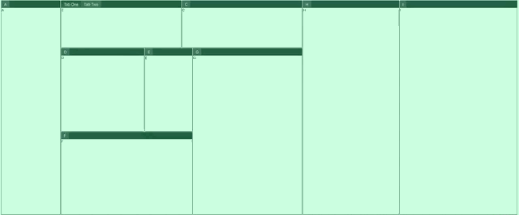
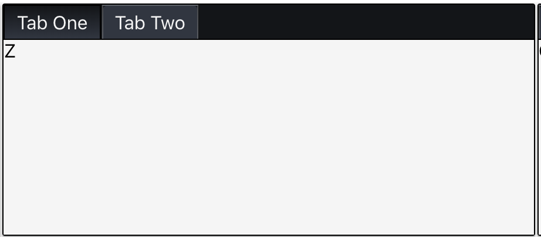

# React Dynamic Grid (Proof of Concept)

This is a proof of concept `heavily` inspired by [react-mosaic](https://github.com/palantir/react-mosaic).

This is currently a research project into what a grid that works nearly identical to `VSCode`, which has implemented a great grid style for their tabs/windows.

Not meant to compete with `react-mosaic` really as we currently use it fairly heavily in our projects.

> To see the current API/props being used for testing, see [App.js](https://github.com/bradennapier/react-grid-poc/blob/master/src/App.js).

### Why not PR?

Simply because I wasn't sure how this would be done in the first place and it was a fun challenge. I also use Flow over Typescript so there's the learning curve there to deal with for now, although we are moving to TS at work so....

### Testing

This is just an ejected `create-react-app` so... clone/fork then `yarn && yarn start`.

### Benefits / Changes over `react-mosaic`

- No dependencies for most part ([`react-dnd`](http://react-dnd.github.io/react-dnd/about) is added and will likely be needed). Dependencies shown in `package.json` are all [`create-react-app`](https://github.com/facebook/create-react-app).

  - [`styled-components`](https://www.styled-components.com/) is currently a dependency but it would be separated easily. Theming with standard react components would be simple.

- Tree vs Binary Tree Format (fixes [react-mosaic#31](https://github.com/palantir/react-mosaic/issues/31))

- Custom constraints per tile and the ability to provide grid-wide constraints by pixels or percent (height and width).

- Provides optional context to children for more performant rendering (fixes [react-mosaic#79](https://github.com/palantir/react-mosaic/issues/79) among other things).
  - For example, `isDragging`, `height`, `width`, `position`, and more are planned (with the latter 3 currently implemented) (fixes [react-mosaic#69](https://github.com/palantir/react-mosaic/issues/69)).

* Stateful Resizing which is how VSCode works.
  - Resizing will move sibling elements further than one step in the tree if needed and if dragged back again the windows return to their original sizes.
  - Releasing the resizer will reset the state for the next resize.
  - This is customizable with options `stateful`, `push`, `passive`. [More Info](https://github.com/bradennapier/react-grid-poc/blob/master/src/grid/controller.js#L110-L154)



- Utilizes [`styled-components`](https://www.styled-components.com/) and CSS Variables for extremely simple theming capabilities. Best to just read the [defaultTheme](./src/grid/themes/dark/index.js) comments to see how this works. Makes dynamic styling extremely efficient but is also not technically dependent on `styled-components`. The components exported could be provided by another means if desired.

> Providing overrides to the selected themes styling is very simple with `styled-components`!

```javascript
import { css } from "styled-components/macro";

const CSS_OVERRIDES = css`
  --dg-tile-padding: 1px;

  --dg-widget-border-radius: 2px;
  --dg-widget-content-background: whitesmoke;
`;

<DynamicGrid cssVariables{CSS_OVERRIDES} />
```

- Tabbed windows opt-in (fixes [react-mosaic#50](https://github.com/palantir/react-mosaic/issues/50)).
  - Providing `<DynamicGrid tabbed>` will render widgets with the ability to do tabbing. This is done by providing a `tabs`, `activeTab`, and optionally `title` property.
  - May customize the tab render by providing `renderTitle` function which is called if found with the context for the `tile`.
  - If not using `tabbed`, you may still provide the `tabs` property. If you also provide `activeTab` it will render the given tab and allows easily providing conditional rendering by modifying that property.
    - If `tabs` is provided without `activeTab` then the first element is rendered by default when `tabbed` is false (or not defined).



- Extremely simple to serialize, similar to `react-mosaic` by simply `JSON.stringify(grid)`.

- **PERFORMANT** - Designed to be extremely performant and provide its dynamic capabilities at a full 60 fps. `react-mosaic` is also quite performant although its biggest failure here is that it can be broken by children inside the grid (for example, a `tradingview chart` cant be used within a node).

### Currently Missing

- Drag & Drop (have to learn React DnD still :-P).
- Flow Typing is not finished or really implemented aside from basic structure for it. Won't be hard to get 100% coverage here though as the overall structures are simple.
- Controlled mode in the same way `react-mosaic` provides it. Not sure this is needed with how this is implemented but considering it. Would not be hard in the end to provide.
